## SafeSteps – Frontend

SAFE HIKING APPLICATION  
Modern, modular React Native app for safe mountain hiking. Includes authentication, difficulty estimation, real-time weather, reviews, and interactive maps.

---

## Prerequisites

- Node.js 18+
- Expo CLI (`npm install -g expo-cli`)
- Android Studio (for emulator)
- Xcode (for iOS, optional)
- Git

---

## 1. Clone the repository

```
git clone https://github.com/PetruselGeorge/safesteps-fe.git
cd safesteps-fe
```

## 2. Install dependecies

```
npm install
```

## 3. Environment Configuration

Create a `.env` file in the root of the project with the following variables:

```env
API_URL=http://0.0.0.0:8080
```

## 4. Start the project

```
npx expo start
```

---

## You can now run the app:

`1. On Android Emulator (via Android Studio)`

`2. On iOS Simulator (macOS + Xcode only)`

`3. Or on your physical device via the Expo Go app (scan QR code)`

---

## Architecture Overview:

The frontend uses a feature-based modular architecture for scalable development.

---

# Preview:

### Start Screen Preview

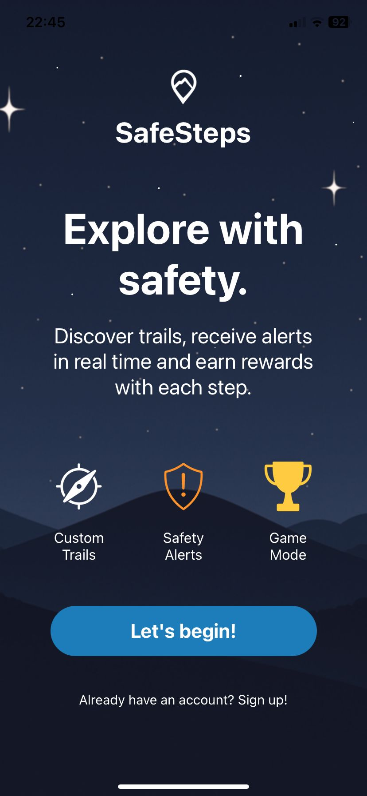

### Register Screen Preview


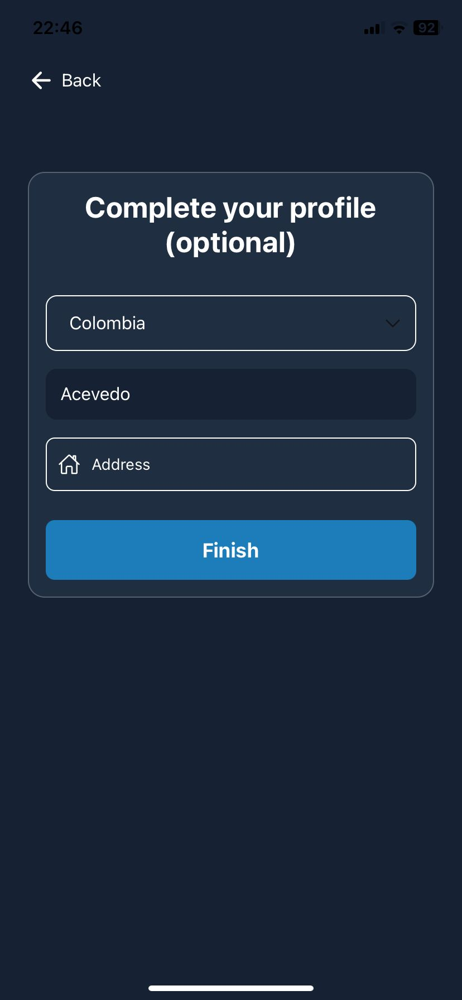

### Home Screen Preview

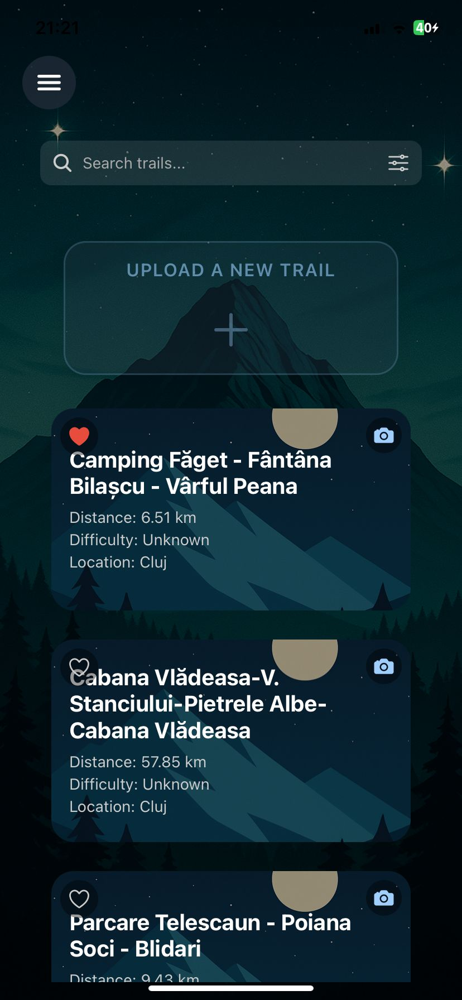

### Favorite Screen Preview

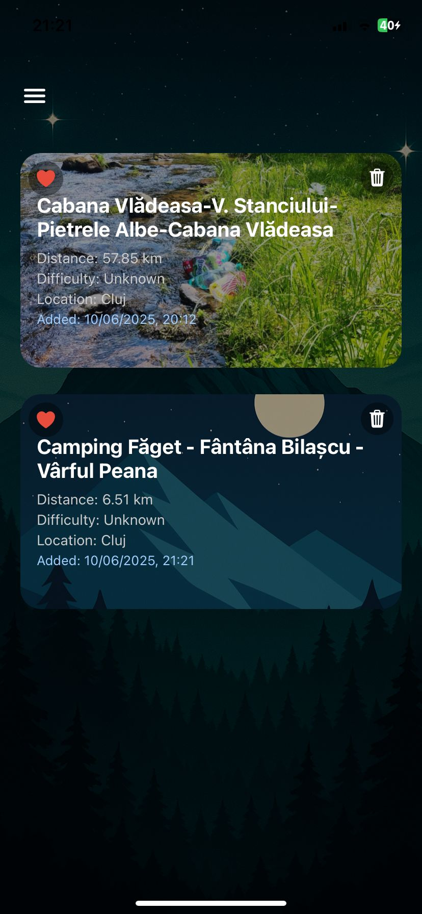


### Add Trail Preview

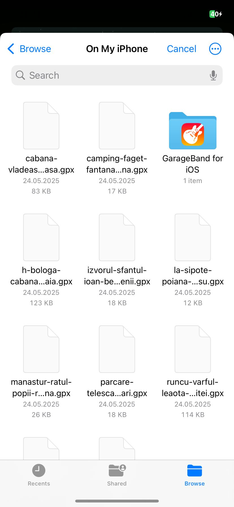
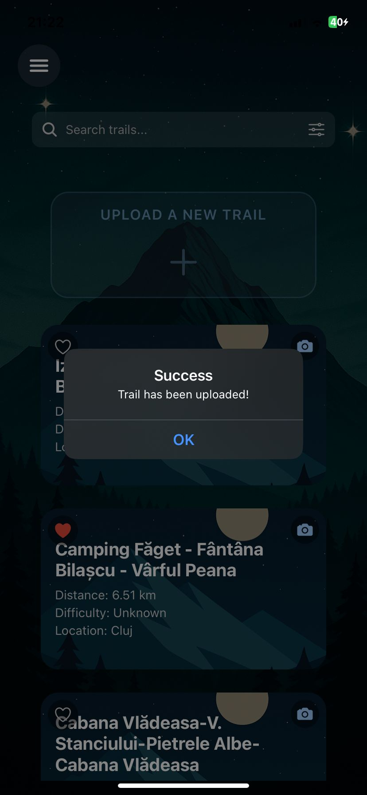

### Trail Info Screen Preview
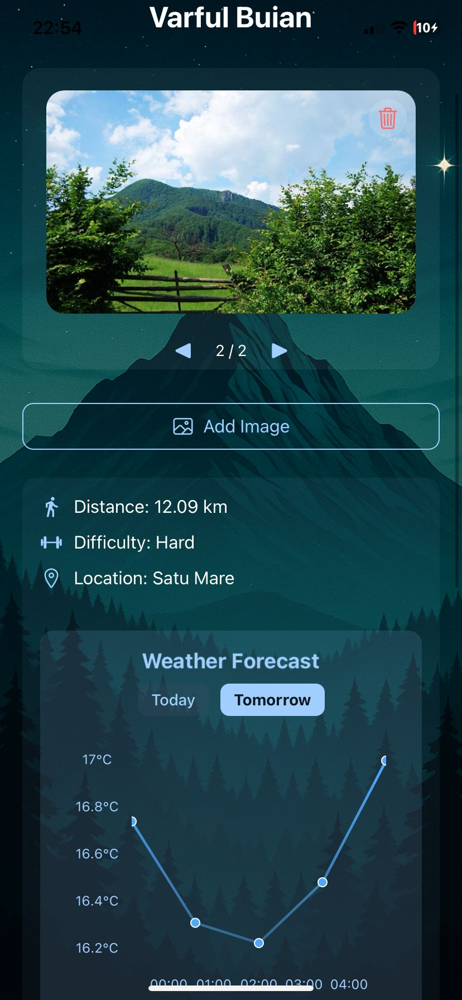
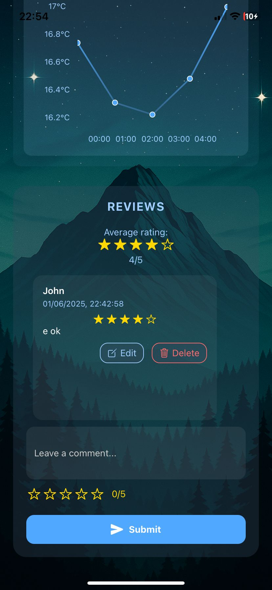
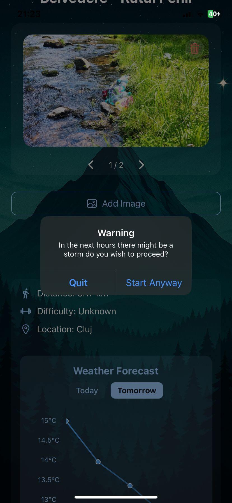

### Trail Map Preview + Alerts

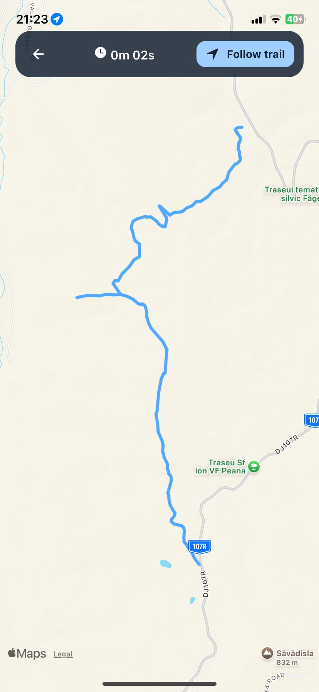
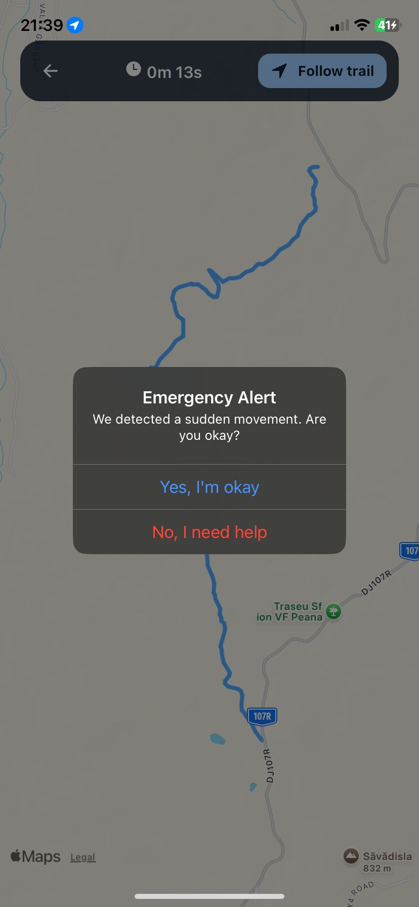
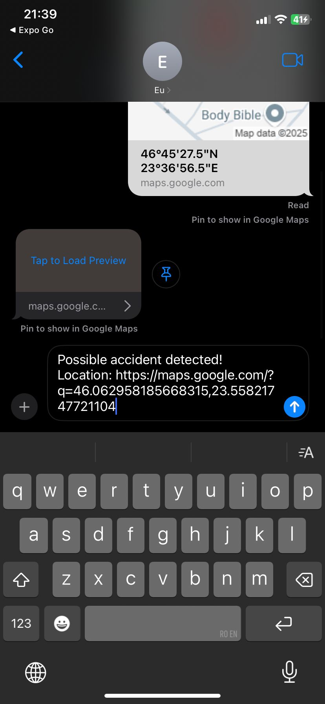

